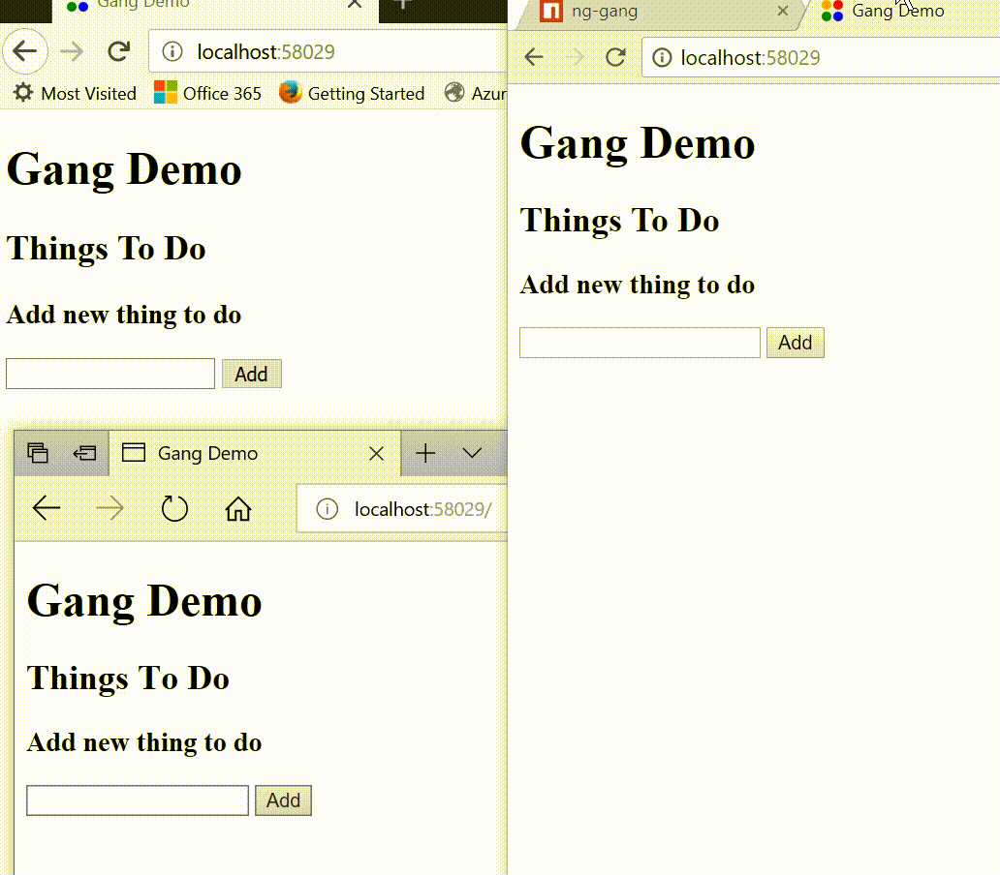

# gang

A state sharing algorithm using a websocket relay server in c# on dotnetcore and JS client for Angular 5

- [Overview](#overview)
- [Packages](#packages)
- [Demo](#demo)
- [Building a Gang Relay Server](#building-a-gang-relay-server)
- [Building a Gang Client App](#building-a-gang-client-app)
- [Authentication](#authentication)

## Overview

A gang has a set of members running the same code, one member is designated as the host.

All members can issue commands, these are sent to the current host. 
The host executes the command and broadcasts the current state to all members.

Should the host be disconnected from the gang, an other becomes the host. 

Gangs are controlled by a single relay server, but the work is done by the current host.

## Packages

| Library           | Description                   | Url                                               |
| :---------------- | :-----------------------------| :------------------------------------------------ |
| Gang              | Core library for relay server | https://www.nuget.org/packages/Gang               |
| Gang.WebSockets   | Gang for Web Sockets          | https://www.nuget.org/packages/Gang.WebSockets    |
| ng-gang           | Angular 5 Client Service      | https://www.npmjs.com/package/ng-gang             |

## Demo

This is a simple Gang ToDo app, written with Angular 5 and TypeScript with a DotNet Core relay. 
(note there is also the Gang.Host project in $/src/gang.sln)

Clone the repo and open the solution $/demo/gang-demo.sln

Make sure you build the client app, ```npm install``` then ```ng build```

Run in visual studio and the ui will popup up.
Open as many browsers as you want on that url to see the collaboration in action


 
## Building a Gang Relay Server

1. Create a new Asp.Net Core Web Application
2. Add nuget package for Gang.WebSockets
3. Configure services in Startup.ConfigureServices

```
public void ConfigureServices(IServiceCollection services)
{
    services.AddWebSocketGangs();
}
```
4. Start the gang relay in Startup.Configure
```
public void Configure(IApplicationBuilder app, IHostingEnvironment env)
{
    [...]
    app.UseWebSocketGangs("/gang-relay");
}
```
See https://github.com/MrAntix/gang/blob/master/demo/Gang.Demo/Startup.cs 

When you run the app, the relay will be running on ```ws://localhost:{someport}/gang-relay```

## Building a Gang Client App

There is a support for Angular 5 https://www.npmjs.com/package/ng-gang

You can install it from npm in the usual way.

```npm i ng-gang --save```

Have a look at the demo app code here https://github.com/MrAntix/gang/tree/master/demo/Gang.Demo/client/app/todo

1. Connect to the relay using ```gang.connect({relative-path}, {gang-id})``` e.g.
```
this.gang.connect('gang-relay', 'todo-demo');
```
2. Subscribe to the commands. Call your handlers to alter the state. 
3. Call gang.sendState() with the mutated state. e.g.
```
this.gang.onCommand.subscribe(wrapper => {

  const handler = `handle${wrapper.type}`;
  const newState = this[handler](wrapper.command);

  this.gang.sendState(newState);
});
```
3. Subscribe to state updates. This will pass new states from the host to your client, 
4. simply replace your state with the new one.
5. (note here I have an apply method to turn the json coming from the server in to proper objects) e.g.
```
this.gang.onState.subscribe(state => {

    this.state = state.map(item => TodoItem.apply(item));
});
```
4. Optionally you have onMemberConnect, onMemberDisconnect observables to manage users if you need to.

## Authentication

There is token based auth, so you can secure entry to the gang. 
This can be passed on connect and authenticated server-side.

Members can be disconnected by the server, you'll need to implement an endpoint to call this by a member. 
See https://github.com/MrAntix/gang/blob/master/src/Gang.Host/Startup.cs as an example.
